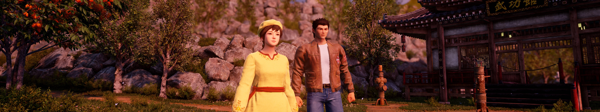

## Shenmue III ultrawide and wider

The tool removes the side black bars visible in the game at 21:9 and wider aspect ratios and allows to control the field of view in real time. Compared to other solutions, it does not affect the visibility of the journal or result in vertical FOV discrepancies.

1. [Download](/../../releases) and unpack the archive.
2. Launch the game first, followed by the tool.
3. Press the hotkeys as instructed.

All trainers based on CE components may trigger some anti-virus software.

Tested on the latest Epic Games Store version at 2560x1080, 3840x1080 and 5760x1080.

You can buy me a [coffee](https://ko-fi.com/rozziroxx) or become a [patron](https://www.patreon.com/rozzi).

### Credits
The game copy and tool creation were generously funded by Johnnius_Maximus and [Ultrawide Benchmarks](https://www.youtube.com/user/m7argy/videos).
